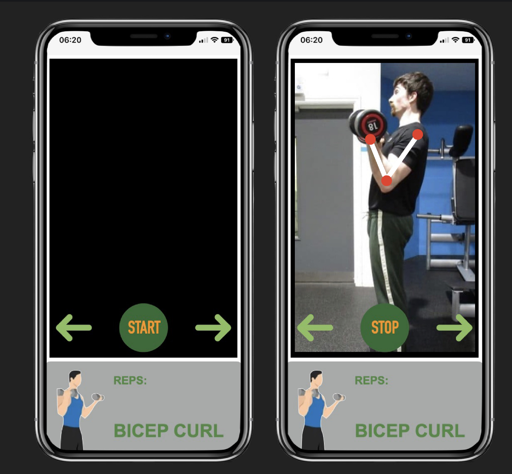

# Fitify-AI-based-fitness-tracker


This repository contains the codes Fitify: An AI based fitness tracker that was presented at E-summit competition 2022. This project won second runner-up at the competion for Business Idea Challenge.

[SLIDES](./assets/FITIFY.pptx)

---
## Contents:
1. Description
2. Installation requirements and steps
3. Files
4. Model accuracy
5. Contact

---
### 1.Description
Fitify is an AI based fitness solution designed to help people workout in the right form and posture. In Fitify, we belive that working out for 10 mins in the right form and posture is better than working out for 30-45 mins with the wrong form. It is designed to help people correct their workout at the ease of their own home. 

### 2. Requirements
```
Python 3.8
Libraries used: OpenCV, Numpy, Mediapipe
```

### 2. Files:
- app.py: This is the main file that contains the code to run the mediapipe pose estimation module. 
- utils.py: This file contains the utility functions such as calculating angle, drawing landmarks, etc.

### 3. Contact:
For more information about the project, please feel free to reach out at: das20ucse101@mahindrauniversity.edu.in

---
